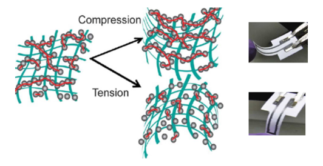
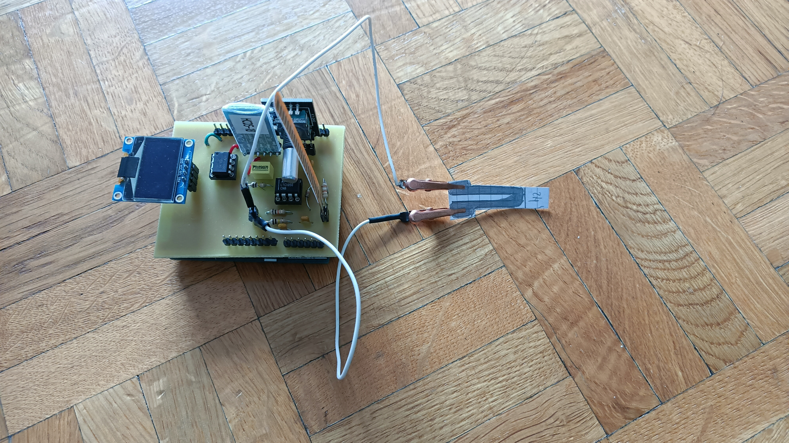
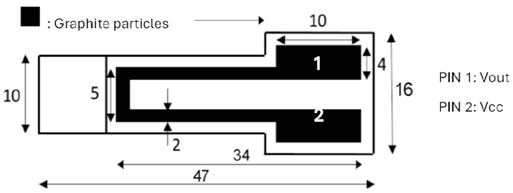
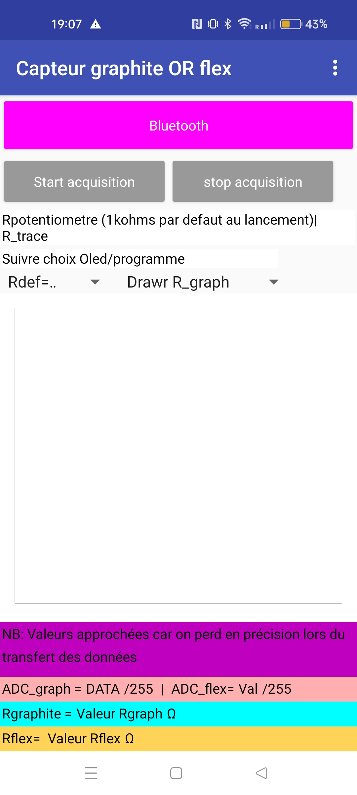
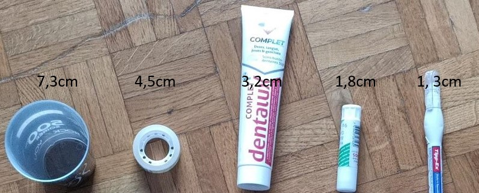

# 2024-2025-4GP-Racheleifrg-Krndnd

# Graphite-based sensor project

**Students**: Rachele Iffrig, Karine Dandy

Département Génie Physique

INSA Toulouse

## Project Description

The aim of this project is to determine the main characteristics of a low-tech strain sensor, as introduced in the paper “Pencil Drawn Strain Gauges and Chemiresistors on Paper”  by Cheng-Wei Lin, Zhibo Zhao, Jaemyung Kim & Jiaxing Huang, published on Nature in 2014, and to compare them with those of an industrial flex sensor. To do so, both sensors are managed by an Arduino Uno board. On this board we also have an OLED screen in order to display the data, and we navigate through the menus using a rotary encoder. The data are sent to an Android application via a Bluetooth® module.   
You can recreate this project from scratch, as we have provided everything — from the PCB design using KiCad, the Arduino code, and the Android app, to the test bench setup used to compare both sensors and create the graphite sensor’s datasheet. 

## Content

In this GitHub repository you will find independent folders for each part of our project.

1) **KiCad**: The KiCad folder contains our project (KiCad-Shield-Uno-FlexSensor) and all the libraries we created and used. It is ready to use, you will only need to download KiCad on your laptop. 
   
2) **Arduino code**: The Arduino folder contains 2 different codes: 
     *code_Flex_OR_graphite_datas_sent_via_bluetooth.ino* and *code_Flex_AND_graphite_datas_sent_via_bluetooth*. Both codes calculate the resistance of the industrial strain gauge sensor as well as the graphite-based one, and are using the rotary encoder to navigate through the different menus displayed on the OLED screen. The difference between the two codes comes with what data we are sending via Bluetooth®. In the first code, at the beginning, the user chooses which sensor’s information they want to plot in the app. The second code sends data from both sensors simultaneously: both resistances are plotted, but with less precision. 
   
3) **Android App**: The Android App folder contains all the information concerning the two apps, made with MIT App Inventor, that are receiving all the data sent via Bluetooth®. With these apps, compatible with Android, you can either plot the resistances of both the flex and graphite sensors simultaneously, or choose to plot only one of them, depending on the code you chose.      

4) **Bench test**: The Bench test folder contains pictures of our graphite-based sensor, and the bench test used.

5) **Results graphite based sensor flex_sensor**: All the results obtained and presented in the sensor's datasheet can be found on the Excel file "Results_graphite-based_sensor_and_flex_sensor". All the calculations made to obtain the relative resistance variation and the deformations are also included in this Excel file. 
   
6) **Sensor project presentation**: The Sensor project presentation folder contains a PowerPoint in which we explain the different steps of our project, the difficulties we faced and the results we obtained.

7) **Datasheet**: The datasheet folder contains the datasheet of our graphite-based sensor. This document describes the main features of the graphite-based sensor, its working principle, its working conditions, and presents the results of the comparison between the flex sensor and graphite-based one. This graphite-based sensor can measure deformations up to 0.006, at room temperature. Higher deformations can break the graphite sensor. 

We found that the hardest pencil (H) was the most sensitive. The same conclusion was also reached by Wei et al. Measurement errors may
have influenced our results, or we may have omitted other unknown factors. Nevertheless, a potential
application for this technology can be observed when using hard pencils. With further material and
experimental modifications, our handmade graphite sensor could be optimized.
 
## Physic behind the low tech strain gauges

This graphite-based sensor works similarly to a strain gauge and can detect mechanical deformations under tension or compression. 
It can measure resistances of the order of the giga-ohm. The working principle relies on the relationship between the average nanoparticle distance and the resistance. 
Due to the granular property of the graphite, under tension, the layer stretches, increasing the distance between the nanoparticles (Figure 1). 
According to percolation theory, the material’s conductivity decreases, while its resistance increases. 
In compression, the distance between the nanoparticles is reduced, and the resistance decreases as more electrical paths are present.

Figure 1 – Working principle of the graphite-based sensor in compression and tension. Extracted from
“Pencil Drawn Strain Gauges and Chemiresistors on Paper”, by Cheng-Wei et al.

## Necessary components to carry out this project

* 1 graphite-based paper sensor
* 1 flex sensor
* 1 LTC1050 operational amplifier
* 1 MCP41050 digital potentiometer
* 1 KY-040 rotary encoder
* 1 Arduino UNO
* 1 OLED screen
* 1 HC-05 Bluetooth® module
* Resistances: 1kΩ, 10kΩ, 100kΩ, 100kΩ
* Capacitors: 100nF, 100nF, 1µF
* For the test bench: 1 round glass, 1 glue stick, 1 tape, 1 toothpaste cap, 1 liquid correction fluid (Tipp-Ex)

<figure>
  
  <figcaption>Figure 2 - Image of the complete project.</figcaption>
</figure>

## How to use

The first step is to create the electrical amplifier circuit and the footprint of the PCB on KiCad. Our complete KiCad project and all the libraries used can be found in the KiCad folder.  

The second step is to order or fabricate the PCB and mount it on an Arduino UNO board. 

By using similar features as our graphite-based sensor (Figure 3), and our Arduino code (available in the Arduino code folder), it is possible to measure a resistance for a given deformation. 

Figure 3 – Representation of our graphite-based sensor. The units are in mm. Extracted from the work
of Paul Besnard and Niels Brun, available on GitHub.

This graphite-based sensor can measure deformations up to 0.006, at room temperature. This sensor can
be made with other paper and graphite pencils to improve sensitivity. We highly recommend
the use of thin papers and harder graphite pencils. 

### Project Assembly

1) Create the PCB using the file *KiCad-Shield-Uno-FlexSensor.kicad_pro* (KiCad/KiCad-Shield-Uno-FlexSensor.kicad_pro) found in the **KiCad** folder. NB: you can also use a breadboard and follow the schematic from the following file: *KiCad-Shield-Uno-FlexSensor.kicad_sch* (KiCad/KiCad-Shield-Uno-FlexSensor.kicad_sch)
2) Solder the components following the PCB and schematic that can be found in the same **KiCad** folder.
3) Connect the PCB to the Arduino, and then connect the Arduino to a PC via USB.
4) Choose one of the two codes from the **Arduino** folder based on your needs.      
5) Once the program is open in the Arduino IDE, select **Arduino Uno** as the board.
6) Run the code.
7) If you chose: *code_Felex_OR_graphite_datas_sent_via_bluetooth.ino* select the data you want to plot on the app, following the instructions that appear on the Serial.

### OLED's Menus
When you upload the code to the Arduino, the OLED screen lights up. On the OLED display, you can access **three different menus**:

1. **Potentiometer Selection Menu**  
   Allows you to choose between **four different potentiometer values**.

2. **Flex Sensor Data Menu**  
   Displays real-time data from the **flex sensor**.

3. **Graphite Sensor Data Menu**  
   Displays real-time data from the **graphite sensor**.   
To switch between menus, press the rotary encoder. Inside each menu, rotate the encoder to scroll through the available options. To select an option (if applicable), press the rotary encoder's switch.

### Android App
1. **Pair your smartphone with the HC-05 Bluetooth module.** If a code is requested, enter **0000** or **1234**.

2. **Download the `.exe` file to your smartphone** by scanning the **QR code** in the folder of the Android App.

3. **Open the application**
4. **Grant the necessary permissions** to the application so it can detect Bluetooth® devices connected to your Android.This can be done via your phone’s **Bluetooth® or app settings**.

5.  **Click on the Bluetooth® button**.

6. **Select the HC-05 module** from the list of available devices.

7. **Select the potentiometer value** that you previously chose using the **OLED menu** on the Arduino.

8. **If you are using the Flex or Graph app**,select the resistance value you chose at the beginning of the program from the **drop-down menu**.

9. **Start data acquisition** by pressing the **Start** button.

10. **Stop data acquisition** by pressing the **Stop** button.

<figure>
  
  <figcaption>Figure 4 - Image of the screen when we open the app</figcaption>
</figure>

### Test Bench

To test and compare our graphite-based sensor to a commercial sensor (the flex sensor), we used five objects with different diameters. We then fabricated and tested our graphite-based sensor using three different types of pencils: 2B, H, and HB.   

Figure 5 – Photograph of the objects used with the corresponding diameters during the bench test.

